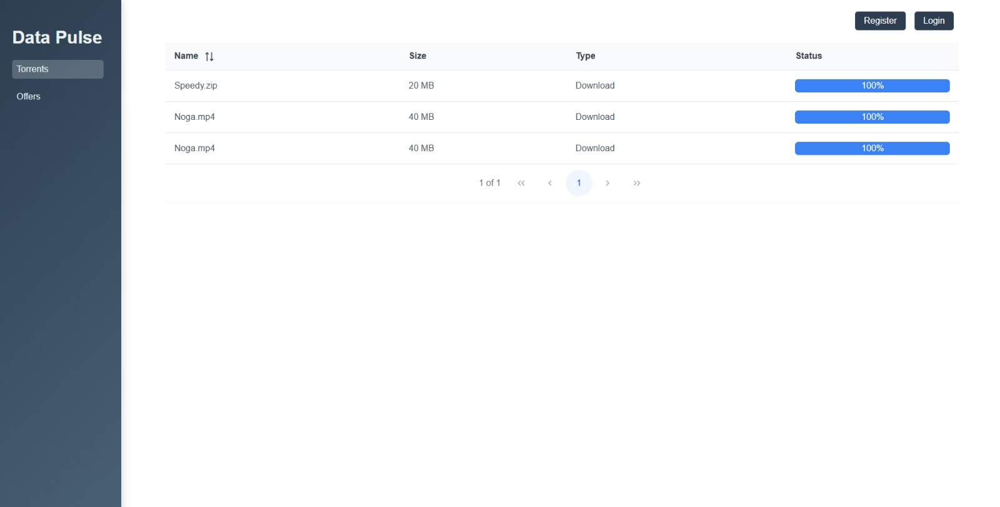
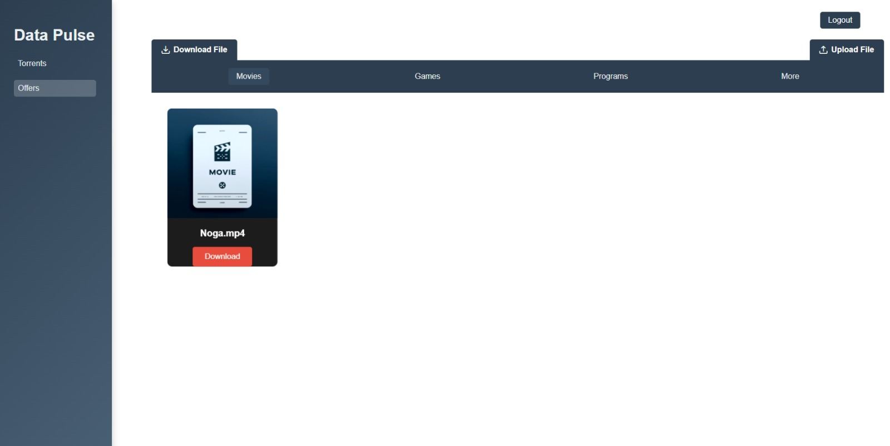

#   


_A next-gen distributed file-sharing platform powered by hybrid P2P and tracker-based architecture._

## 📌 Overview
DataPulse enables users to efficiently share and download files using a hybrid **peer-to-peer (P2P) and tracker-based architecture**. 
With **end-to-end encryption (RSA & AES)**, **multi-threaded downloads**, and a **real-time tracker**, DataPulse ensures a **fast, secure, and scalable** file-sharing experience.

---

## 🔥 Features
✅ **P2P File Sharing** – Efficient and decentralized file transfer.  
✅ **Multi-Threaded Parallel Downloads** – Download files from multiple peers simultaneously for speed.  
✅ **End-to-End Encryption** – RSA and AES encryption for secure data transfer.  
✅ **FastAPI Tracker** – Manages peers and files with high efficiency.  
✅ **Flask Backend** – Handles user authentication, file uploads, and downloads.  
✅ **MongoDB Database** – Stores peer and file metadata.  
✅ **Real-Time Peer Updates** – Prevents busy peers from being selected for downloads.  
✅ **Netflix-Like Offers Component** – Users can browse and download files categorized as **Movies**, **Games**, **Programs**, and more through an intuitive interface.

---

## 📂 Project Structure
DataPulse is organized into three main branches, each handling a crucial part of the system:

### 1️⃣ **Main (Frontend - Angular)**
🏗 **The UI of DataPulse**, built with Angular, provides an intuitive interface for users to browse, search, and manage downloads. 
#### 🔧 Technologies:
- Angular 17 for frontend development
- Tailwind CSS for styling
- TypeScript for frontend logic

#### 📸 Screenshot:


---

### 2️⃣ **client-backend (Backend for Client - Python)**
💻 **Handles backend logic for the UI and communication with the Tracker.** 

#### 🔧 Technologies:
- Flask for API endpoints
- WebSockets for peer-to-peer communication
- RSA and AES encryption for secure file transfers
- MongoDB for data storage

#### ⚙️ How it Works:
- Listens for HTTP requests on **port 8001** while opening **dynamic ports** for file uploads.
- Uses **multi-threading** to maximize download speed.
- Supports **simultaneous downloads from up to 5 peers**.
- Announces its availability to the Tracker for optimized peer selection.

---

### 3️⃣ **tracker (Centralized Tracker - FastAPI)**
📡 **The brain of the system, managing peer connections and file availability.**

#### 🔧 Technologies:
- FastAPI for high-performance API handling
- MongoDB for storing peers and file metadata
- JWT Authentication for security

#### 🔍 Key Features:
- Authentication system (**Registration, Login**)
- Peer management (**Tracking available peers, marking busy peers**)
- File indexing (**Tracking which peers have which chunks**)

---

## ⚙️ How DataPulse Works
1️⃣ **User Login & Authentication** 🔑 – Users log in via the UI, and authentication is handled via the Tracker.
2️⃣ **File Discovery & Peer Selection** 📁 – The Tracker returns a list of peers that have the required file chunks.
3️⃣ **Secure Key Exchange (RSA)** 🔐 – Before downloading, the client requests the peer's public key.
4️⃣ **Chunked Parallel Download (Multi-Threading)** 🚀 – Simultaneous downloads from multiple peers.
5️⃣ **File Merging & Verification** ✅ – Ensures integrity using **SHA-1 hash checks**.
6️⃣ **Upload Handling** 📤 – Peers also serve files to others, updating their availability in real-time.

---

## 🛠 Running the Project

### 🛰 Tracker (Centralized Server)
Run the tracker using FastAPI:
```sh
uvicorn app.main:app --host 0.0.0.0 --port 8000 --reload
```
This starts the Tracker API on **port 8000**.

### 🔙 Client Backend (Python)
Run the backend that communicates with both the UI and the Tracker:
```sh
python main.py
```

### 🎨 Frontend (Angular UI)
Run the UI for users to interact with:
```sh
npm install
npm start
```
This starts the Angular UI at **http://localhost:4200**.

---

## 🚀 Future Enhancements
🔷 **WebSocket Integration** – Real-time notifications when downloads complete.  
🔷 **Adaptive Bandwidth Control** – Dynamically adjust download speeds based on network conditions.  
🔷 **Decentralized Mode** – Reduce dependency on the Tracker for a fully distributed experience.  

---

## 🤝 Contributing
We welcome contributions! Feel free to fork the project, submit pull requests, and enhance DataPulse.

---


📧 For questions or collaboration, reach out to [Ofek Ben Avraham](mailto:benavrahamofek@gmail.com) or to [Rotem Porat](mailto:rotem1591@gmail.com).

